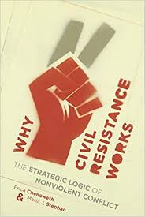

# Exploring-Why-Civil-Resistance-Works

For more than a century, from 1900 to 2006, campaigns of nonviolent resistance were more than twice as effective as their violent counterparts in achieving their stated goals. By attracting impressive support from citizens, whose activism takes the form of protests, boycotts, civil disobedience, and other forms of nonviolent noncooperation, these efforts help separate regimes from their main sources of power and produce remarkable results, even in Iran, Burma, the Philippines, and the Palestinian Territories.

In this report, some of the findings of this research done by Erical Chenoweth and Maria J. Stephan will be replicated. The results of the reseach were then published as a book with the name Why Civil Resistance Works

You can find the data at https://www.ericachenoweth.com/wp-content/uploads/2012/01/Data-and-Replication-Files-3.zip and data documentation at https://www.ericachenoweth.com/wp-content/uploads/2019/07/WCRW-Appendix.pdf.

Read the report [here](Why_Civil_Resistance_Works.ipynb)